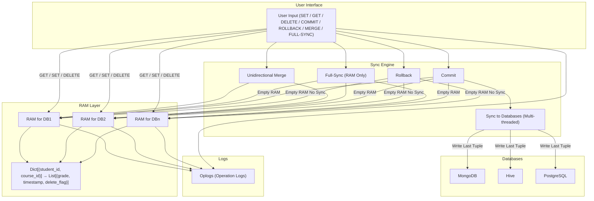

# Multi-Database Synchronization System with RAM-Based Operation History

## Table of Contents:
1. [Overview](#overview)
2. [Core Components](#core-components)
3. [RAM Based Temporary Memory Layer](#ram-based-temporary-memory-layer)
4. [Synchronization Features](#synchronization-features)
5. [Transaction Management](#transaction-management)
6. [Extensibility](#extensibility)
7. [Operation Logs](#operation-logs)
8. [Technical Highlights](#technical-highlights)
9. [Limitations and Notes](#limitation-and-notes)
10. [Challenges faced and solutions used to solve them](#challenges-faced-and-solutions-used-to-solve-them)
11. [Flowchart of the design of the system](#flowchart-of-the-design-of-the-system)

## Overview

This project implements a synchronization system for **multiple heterogeneous databases** such as **MongoDB, Hive, PostgreSQL**, etc. It maintains a **temporary memory layer (RAM)** for each database that logs all operations with support for **undo, rollback, merge, and commit** features.

The system ensures consistency and extensibility across databases while maintaining an efficient operation history. Multi-threading and operation logs are also incorporated for performance and traceability.

---

## Core Components

### 1. Databases Supported

- MongoDB  
- Hive  
- PostgreSQL  

> **Extensible** to other databases with custom connectors.

### 2. Data Structure

Each database maintains entries with the following structure:

| Field      | Description                  |
|------------|------------------------------|
| student ID | Primary key (part of key)    |
| course ID  | Primary key (part of key)    |
| grade      | Value associated with key    |

> **Key** = (student ID, course ID)

---

## RAM Based Temporary Memory Layer

### 1. Motivation

Inspired by **system RAM**, changes are staged here before being committed to disk. This allows for:

- Fast write operations  
- Rollbacks  
- Undo capabilities  

### 2. Structure

Each database has a corresponding **RAM**, a `map or dictionary` of:

```python
Dict[Tuple[student_id, course_id], List[Tuple[grade, timestamp, delete_flag]]]
```
- Key: (student ID, course ID)
- Value: Stack (vector) of tuples of the format (grade, timestamp, delete_flag). The delete_flag is True if deleted, else False.
Thus, the RAM stores a history stack of all changes to each key.

### 3. Supported RAM Operations:
a. SET:
- Adds new (grade, timestamp, False) tuple to the stack.
- Adds new keys to RAM if absent.
- Auto-adds new key to database if not present.

b. GET:
- Returns the grade from the top of the stack (most recent).
- If delete_flag = True, reports the key as deleted.
- If key not found in RAM, queries the database.

c. DELETE:
- Pushes (last_known_grade, timestamp, True) to stack.
- Does not immediately remove the key; marks for deletion.

d. UNDO:
- Pops the last tuple in the key's stack (if available).
- Reverts to the previous version of the key (or removes if none).

## Synchronization Features

### 1. MERGE (Unidirectional)
- One RAM merges from another RAM.
- Transfers: a) all new keys and b) all latest values (based on timestamp).
- Only RAM is updated, databases remain unchanged.

### 2. FULL SYNC
- Merges all RAMs together.
- Latest data for each key is propagated across all RAMs.
- Non-reversible operation.
- No database update.

### 3. SYNC
- RAM → Database synchronization.
- Uses multi-threading, with one thread per database.
- Retrieves only the latest version of each key from RAM.
- Ideal for large datasets; non-threaded mode available for small data.
- Uses concurrency to save time.
- The SYNC operation can be used as a failover mechanism by scheduling it as a cron job to avoid data loss if the program crashes. Thus, at least some part of the changes made by the oplogs file can be recorded in the database and thus, prevent complete loss of data, if the program crashes.

## Transaction Management
### COMMIT
- Writes all staged RAM changes to disk (databases).
- Empties the RAM (RAM → disk).

### ROLLBACK
- Empties the RAM without writing to disk.
- Discards all changes since last commit.
- Irreversible operation.

## Extensibility
- Add any number of databases.
- Just include the appropriate connector.
- Register database name in the databases[] list in the main program.
- It is like installing drivers when adding new hardware components to a system. The appropriate code must be added to include the new database and corresponding handlers must be used. However, it is very easy to include a new database in the system because the philosophy for each database specific code remains the same for all databases.

## Operation Logs
- To simulate the user activity in the frontend, a universal oplogs file must be given to our system, following the syntax.
- Then, this universal oplogs file is broken down into oplogs file specific to each database by filtering out all the operations that involve that particular database.
### Corresponding to each database the system maintains an oplog (operation log) that:
- Records every SET, DELETE, and UNDO operation.
- Tracks timestamp and value of each change.
- Allows user to review change history after each input.

## Technical Highlights:
- Designed with multithreaded architecture for high performance.
- RAM layer enables: a) Efficient change tracking, b) Quick rollbacks and c) Seamless merge and sync
- Undo stack model facilitates per-key operation history.

## Limitation and Notes
- FULL-SYNC() is not reversible.
- ROLLBACK() discards all staged data since the last commit.
- Sync to disk only includes latest state per key.
- Real-time consistency between databases only after commit.

## Challenges faced and solutions used to solve them
- Initially, the RAM and DB synchromization was done after every A.MERGE(B) call, on a separate thread.
- We noticed that if there were 2 or more consecutive MERGE calls where the recipient DB was same (for example: 2 consecutive A.MERGE(B) and A.MERGE(C) calls) then our code was getting stuck and not executing ahead.
- The issue here was that in the case of 2 or more consecutive MERGE calls where the recipient DB was same, 2 threads (or more) were locking the DB to write to it which was ultimately leading to a deadlock situation.
- To solve this, we used multithreading at the very end of the code or after a SYNC call, using one thread per DB. This solves the issue of multiple threads trying to lock the same DB and thus, avoids deadlock.

## Flowchart of the design of the system:


