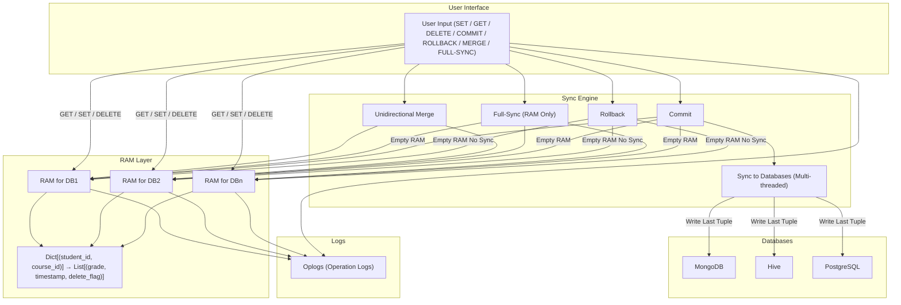

# Multi-Database Synchronization System with RAM-Based Operation History

## Table of Contents:
1. [Overview](#overview)
2. [Core Components](#core-components)
3. [RAM Based Temporary Memory Layer](#ram-based-temporary-memory-layer)
4. [Flowchart of the design of the system](#flowchart-of-the-design-of-the-system)

## Overview

This project implements a synchronization system for **multiple heterogeneous databases** such as **MongoDB, Hive, PostgreSQL**, etc. It maintains a **temporary memory layer (RAM)** for each database that logs all operations with support for **undo, rollback, merge, and commit** features.

The system ensures consistency and extensibility across databases while maintaining an efficient operation history. Multi-threading and operation logs are also incorporated for performance and traceability.

---

## Core Components

### 1. Databases Supported

- MongoDB  
- Hive  
- PostgreSQL  

> **Extensible** to other databases with custom connectors.

### 2. Data Structure

Each database maintains entries with the following structure:

| Field      | Description                  |
|------------|------------------------------|
| student ID | Primary key (part of key)    |
| course ID  | Primary key (part of key)    |
| grade      | Value associated with key    |

> **Key** = (student ID, course ID)

---

## RAM Based Temporary Memory Layer

### 1. Motivation

Inspired by **system RAM**, changes are staged here before being committed to disk. This allows for:

- Fast write operations  
- Rollbacks  
- Undo capabilities  

### 2. Structure

Each database has a corresponding **RAM**, a `map or dictionary` of:

```python
Dict[Tuple[student_id, course_id], List[Tuple[grade, timestamp, delete_flag]]]
```
- Key: (student ID, course ID)
- Value: Stack (vector) of tuples of the format (grade, timestamp, delete_flag). The delete_flag is True if deleted, else False.
Thus, the RAM stores a history stack of all changes to each key.

### 3. Supported RAM Operations:
a. SET:
- Adds new (grade, timestamp, False) tuple to the stack.
- Adds new keys to RAM if absent.
- Auto-adds new key to database if not present.

b. GET:
- Returns the grade from the top of the stack (most recent).
- If delete_flag = True, reports the key as deleted.
- If key not found in RAM, queries the database.

c. DELETE:
- Pushes (last_known_grade, timestamp, True) to stack.
- Does not immediately remove the key; marks for deletion.

d. UNDO:
- Pops the last tuple in the key's stack (if available).
- Reverts to the previous version of the key (or removes if none).

## Flowchart of the design of the system:


